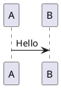

这是一个段落。  
这是一个段落。

<!-- more -->

一级标题
=========
二级标题
---------
# 一级标题
## 二级标题
### 三级标题
#### 四级标题
##### 五级标题
###### 六级标题

> 区块引用
> > 嵌套引用

* 第一项
  + 第一项
  + 第二项
  + 第三项
* 第二项
  - 第一项
  - 第二项
  - 第三项
* 第三项
  1. 第一项
  3. 第二项
  2. 第三项

---------
*********
_________

    void main()
    {
        printf("Hello, Markdown.");
    }

```c
void main()
{
    printf("Hello, Markdown.");
}
```

|    1    |    2    |    3    |
| :------ | :-----: | ------: |
|  aaaaa  |  bbbbb  |  ccccc  |
|  *ABC*  |  *123*  |  *abc*  |

- [ ] 任务A
- [x] 任务B
  - [x] 任务1
  - [x] 任务2
  - [x] 任务3
- [ ] 任务C

Definition
: 这是一个定义。

<https://www.baidu.com/>
[链接](https://www.baidu.com/ "Baidu")
[链接][link]

![图片][image]{.fancybox .center-block}
[锚点](#anchor "Anchor")
[锚点][anchor]

[link]: https://www.baidu.com/ "Baidu"
[image]: https://www.baidu.com/img/bd_logo1.png "Baidu"
[anchor]: #anchor "Anchor"
锚点{#anchor name=anchor}

这是一个脚注[^1]。

[^1]: https://www.baidu.com/

这是一个缩写（HTML）。

*[HTML]: Hyper Text Markup Language

H^2^，H~2~
*斜体*，_斜体_
**粗体**，__粗体__
***粗斜体***，___粗斜体___
~~删除~~，++插入++，==标记==
`printf("Hello, Markdown.");`

\\，\`，\*，\_，\{\}，\[\]，\(\)，\#，\+，\-，\.，\!

&，<，&copy;，:smile:，$E=mc^2$

$$\begin{cases}
a_1x+b_1y+c_1z=d_1\\
a_2x+b_2y+c_2z=d_2\\
a_3x+b_3y+c_3z=d_3
\end{cases}$$




Do not just seek happiness for yourself. Seek happiness for all. Through kindness. Through mercy.



Every interaction is both precious and an opportunity to delight.



_.compact([0, 1, false, 2, '', 3]);
=> [1, 2, 3]


{% iframe https://www.baidu.com/ 100% 300 %}




